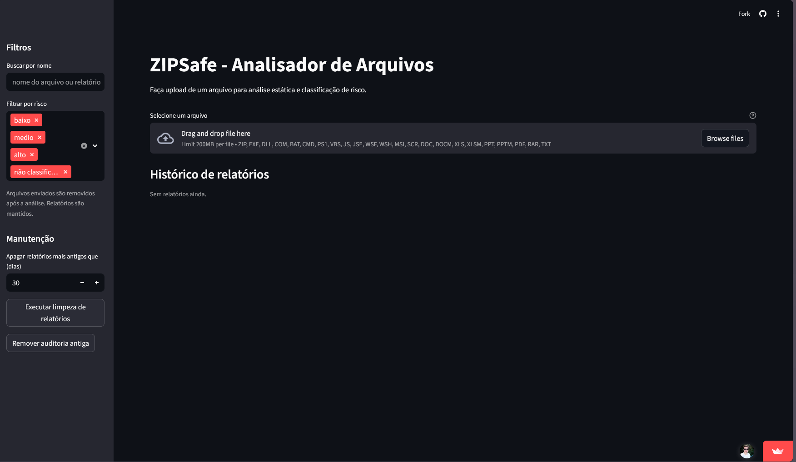
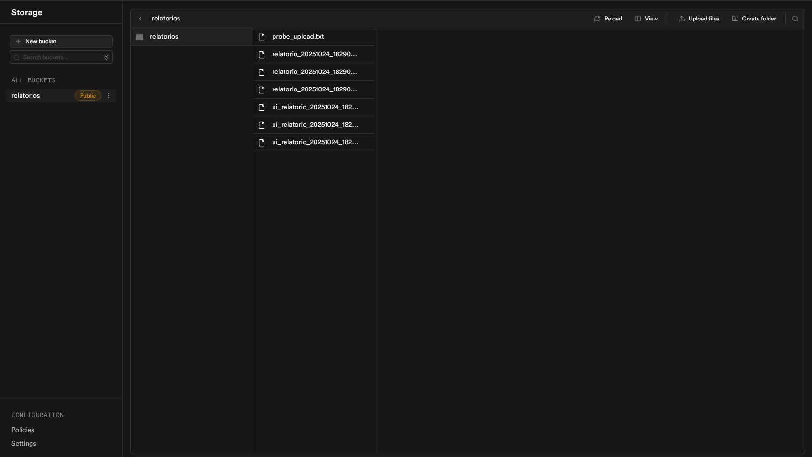

# 🧠 ZIPSafe — Sistema de IA para Detecção Preventiva de Arquivos Maliciosos

ZIPSafe é uma aplicação de **análise estática assistida por Inteligência Artificial** para identificar arquivos potencialmente perigosos **antes** de serem abertos.  
O sistema inspeciona **ZIPs, documentos e scripts**, extrai metadados e classifica o **nível de risco** com base em padrões aprendidos por um modelo de IA.

🔗 **Demo (Streamlit):** https://celohelp-projeto-faculdade-zipsafe-srcapp-streamlit-tuiqdl.streamlit.app/

---

## 🎯 Motivação

O projeto nasceu de um **incidente real**: um **ZIP com script `.vbs`** foi enviado automaticamente a vários contatos do WhatsApp corporativo de uma loja de materiais de construção.  
Isso evidenciou como **engenharia social + arquivos disfarçados** seguem sendo portas de entrada comuns.

O ZIPSafe entrega respostas objetivas:
> “Posso abrir esse arquivo?”  
> “Por que ele é arriscado?”

Além disso, gera **relatórios auditáveis** (HTML/CSV/JSON) para conscientização e rastreabilidade.

---

## 🧩 Principais funcionalidades

- **Upload seguro** de arquivos: `.zip`, `.exe`, `.vbs`, `.xlsm`, `.pdf`, `.txt` e mais.  
- **Análise estática (sem execução)**:
  - Metadados (tamanho, extensão, MIME);
  - **Entropia** (sinais de ofuscação/criptografia);
  - **Macros** em Office (`oletools/olevba`);
  - **Inspeção de ZIP** (lista interna sem extrair);
  - Amostra dos **primeiros bytes** (hex/ASCII) para diagnóstico.
- **Classificação de risco com IA**: `baixo`, `médio`, `alto`.  
- **Relatórios automáticos**: HTML, CSV e JSON (links públicos via Supabase ou fallback local).  
- **Histórico** com filtros, links clicáveis e auditoria de execução.

---

## 🧠 Arquitetura

- `src/app_streamlit.py` — UI (Streamlit): upload → análise → relatório → histórico;  
- `src/analisador_estatico.py` — análise de metadados e detecção de padrões;  
- `src/main.py` — orquestra análise, aplica IA e salva relatórios;  
- `src/utils.py` — utilidades, integração Supabase e fallback local;  
- `src/treino_modelo.py` — pipeline de treinamento e avaliação do modelo;  
- `scripts/` — diagnósticos (ex.: `check_supabase.py`, `storage_upload_probe.py`);  
- `output/` — artefatos do modelo e relatórios;  
- `data/` — datasets sintéticos e arquivos de teste.

---

## 📸 Screenshots

- Tela inicial do ZIPSafe



- Integração com Supabase Storage (bucket de relatórios)



---

## ⚙️ Como a IA foi treinada

**Dados sintéticos** (via `Faker`) com rótulos “seguro”/“malicioso”, considerando:
- Extensão (`.zip`, `.exe`, `.vbs`, `.xlsm`, `.pdf`);
- Nome + palavras suspeitas (`orcamento`, `payment`, `urgent`, etc.);
- **Entropia**, tamanho e flags (macro, executável dentro do ZIP).

**Pipeline:**
1. Geração do dataset + rótulos;  
2. Vetorização de texto (`CountVectorizer`, n-grams 2–4) + features numéricas/booleanas;  
3. Split treino/teste (`train_test_split`, 20%, `random_state=42`);  
4. Modelos: `MultinomialNB` e/ou `DecisionTreeClassifier`;  
5. Métricas (acurácia, precisão, recall) e **matriz de confusão**;  
6. Artefatos salvos em `output/modelo/`: `model.pkl`, `vectorizer.pkl`, `label_encoder.pkl`.

---

## 🚀 Como executar

### 1) Dependências

```bash
pip install -r requirements.txt
```

### 2) Treinar o modelo (gera dataset + artefatos)

```bash
python src/treino_modelo.py
```
- Dataset: `data/dataset_exemplo.csv`  
- Modelo: `output/modelo/`  
- Gráfico: `output/relatorios/matriz_confusao.png`

### 3) Analisar um arquivo (CLI)

```bash
python src/main.py data/arquivos_exemplo/orcamento_malicioso.zip
```
- Saída: relatórios em `output/relatorios/` (HTML/CSV/JSON) com risco (baixo/médio/alto) e motivos.

---

## ☁️ Integração com Supabase (opcional)

Crie `.streamlit/secrets.toml`:

```toml
supabase_url = "https://<YOUR_PROJECT>.supabase.co"
supabase_key = "<SERVICE_ROLE_OR_ANON_KEY>"
supabase_bucket = "relatorios"
supabase_table = "reports"
```

- Armazena relatórios/artefatos e registra histórico com URLs públicos;  
- Fallback local se não houver conexão;  
- Cabeçalhos de upload: `{ "contentType": "text/plain", "upsert": "true" }`.

### 📦 Exemplo de integração com o Storage do Supabase

O ZIPSafe utiliza o Supabase Storage para armazenar relatórios gerados pela IA e disponibilizá-los por links públicos.  
Cada análise realizada é sincronizada com o bucket configurado (`relatorios`) e registrada na tabela `public.reports` para rastreabilidade.

---

## 🔐 Boas práticas de segurança

- Nunca execute arquivos extraídos de ZIPs suspeitos.  
- Prefira análise estática; se precisar de dinâmica, use VM/sandbox isolada com snapshot.  
- Registre hashes (SHA256/MD5), horário, operador e decisão (auditoria).  
- No WhatsApp: verifique aparelhos conectados, desconecte sessões e ative 2FA.

---

## 🧮 Exemplo de classificação

| Arquivo analisado       | Extensão | Entropia | Sinais detectados             | Risco |
|-------------------------|----------|----------|-------------------------------|-------|
| `orcamento_2025.zip`    | zip      | 7.9      | Contém `.vbs`/`.exe` internos | 🔴 Alto |
| `tabela_precos.xlsm`    | xlsm     | 6.2      | Macros detectadas             | 🟠 Médio |
| `lista_produtos.pdf`    | pdf      | 4.1      | Sem sinais suspeitos          | 🟢 Baixo |

---

## 📈 Roadmap

- Explicabilidade (feature importance / SHAP);  
- Integração com sandbox dinâmica (VM isolada);  
- Dashboard web (Streamlit Cloud + Supabase);  
- Regras heurísticas específicas PT-BR;  
- Logs detalhados com SHA256 e trilha de auditoria.

---

## 🧾 Licença & Contribuição

- Licença MIT.  
- PRs bem-vindos (commits semânticos: `feat`, `fix`, `docs`, `refactor`, `test`, `chore`).
